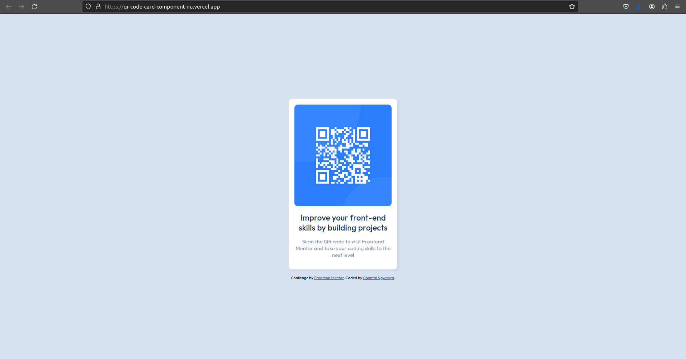

# Frontend Mentor - QR code component solution

This is a solution to the [QR code component challenge on Frontend Mentor](https://www.frontendmentor.io/challenges/qr-code-component-iux_sIO_H). Frontend Mentor challenges help you improve your coding skills by building realistic projects. 

## Table of contents

- [Overview](#overview)
  - [Screenshot](#screenshot)
  - [Links](#links)
- [My process](#my-process)
  - [Built with](#built-with)
  - [What I learned](#what-i-learned)
  - [Continued development](#continued-development)
  - [Useful resources](#useful-resources)
- [Author](#author)
- [Acknowledgments](#acknowledgments)


## Overview

### Screenshot




### Links

- Solution URL: [Chantal Ngwenya](https://github.com/ChantalNgwenya)
- Live Site URL: [Chantal's live site](https://vercel.com/chantalngwenyas-projects/qr-code-card-component)

## My process

### Built with

- Semantic HTML5 markup
- CSS custom properties
- Flexbox
- CSS Grid
- Mobile-first workflow
- [Styled Components](https://styled-components.com/) - For styles

### What I learned

As a newbie in learning HTML and CSS , I'm pround that I get the hang of HTML. 
Throughout doing this project I learned how to style the image and to be at the center of the page. 
I learned how to link the font type into my stylesheet.

Always open to any comments.

```html
<h1>Some HTML code I'm proud of</h1>
  <link 
    rel="preconnect" 
    href="https://fonts.googleapis.com"
  >

<link
  rel="preconnect" 
  href="https://fonts.gstatic.com" crossorigin
>

<link
  rel="stylesheet"
  href="https://fonts.googleapis.com/css2?family=Outfit&display=swap" 
>
```
```css
body {
    font-family: 'Outfit', sans-serif;
	background-color: hsl(212, 45%, 89%);
	font-size: 15px;
	display: flex;
	flex-direction: column;
	align-items: center;
	justify-content: center;
	height: 100vh;
}

.container {
	background-color: hsl(0, 0%, 100%);
	box-shadow: 5px 5px 5px rgba(0, 0, 0, 0.05);
	border-radius: 0.625rem;
	max-width: 17rem;
	padding: 1rem;
	margin-bottom: 1rem;
}

img {
	width: 100%;
	border-radius: 0.625rem;
	max-height: 18rem;
	max-width: 18rem;
}
```

### Continued development

I want to create my own QR Generator so that this can be the standard template.

Links to documents or other content could be contained in the QR code. I am going to ponder on anything that might be helpful.

To also play arond css properties.

### Useful resources

- [Learn HTML](https://developer.mozilla.org/en-US/docs/Learn/HTML/Tables/Basics) - This is an amazing article which helped me understand HTML basics.


## Author

- Frontend Mentor - [@ChantalNgwenya](https://www.frontendmentor.io/profile/ChantalNgwenya)
- Live Site URL: [Chantal's live site](https://vercel.com/chantalngwenyas-projects/qr-code-card-component)


## Acknowledgments

I got help on how to approach the project.
[Thomas](https://youtu.be/JFyMWwOxHYM?si=VlTKqYgJspuweGd7)

